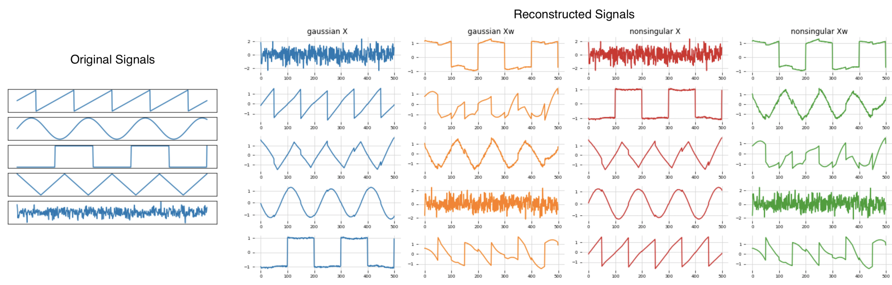

# Machine Learning 2

### Description
Repository of UvA's lab exercises for the course "Machine Learning 2" 2019.

## [__Lab 1 - Independent Component Analysis__](lab1/12402559_12141666_lab1.ipynb)

In this assignment, we implement the __Independent Component Analysis__ algorithm,
as described in chapter 34 of David MacKay's book "Information Theory, Inference, and Learning Algorithms".

  

    Results of signal reconstruction using different priors and W matrix initialization.

- [Code](lab1/12402559_12141666_lab1.ipynb)

## [__Lab 2 - Inference in Graphical Models__](lab2/12402559_12141666_lab2.ipynb)

In this assignment, we implement the sum-product and max-sum algorithms for factor graphs over discrete variables.

- [Code](lab2/12402559_12141666_lab2.ipynb)

###### _Acknowledgement - References_

_The majority of the projects come from the lab assignments of the [Machine Learning 2](https://coursecatalogue.uva.nl/xmlpages/page/2019-2020-en/search-course/course/73105) course of the MSc in Artificial Intelligence at the University of Amsterdam._